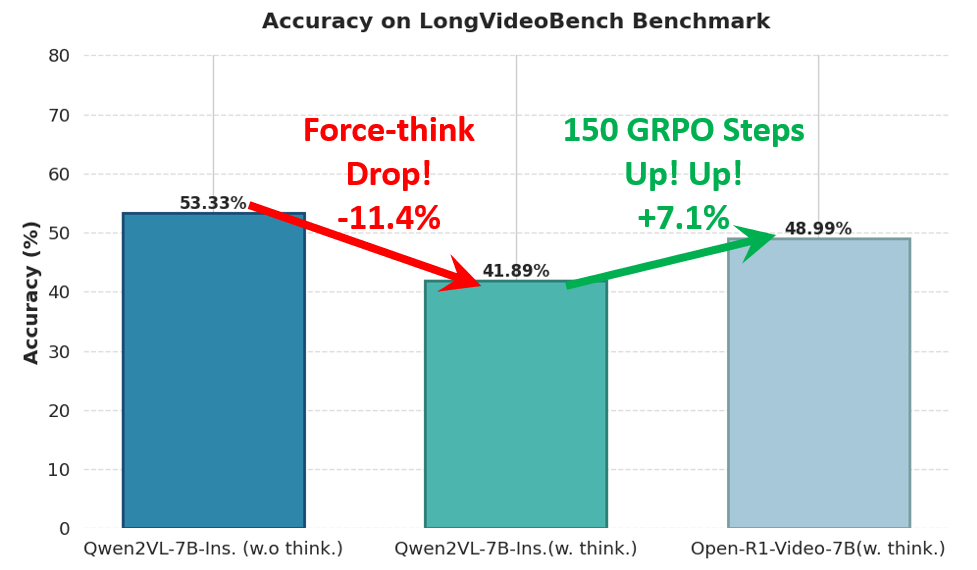
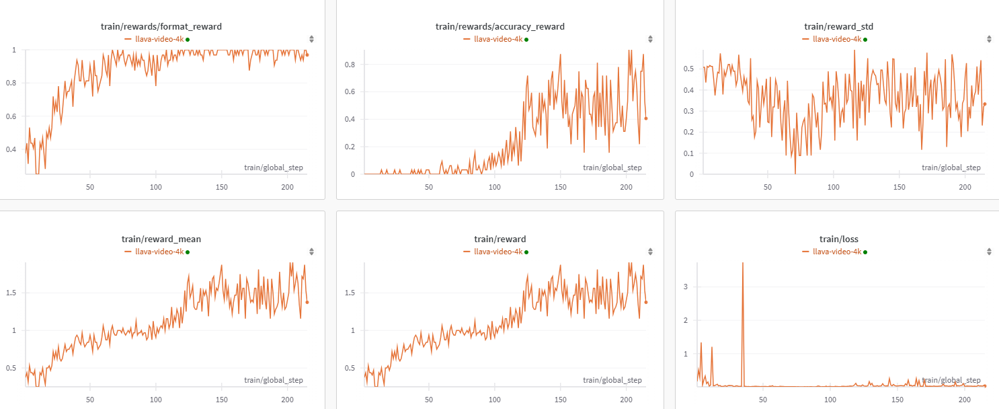
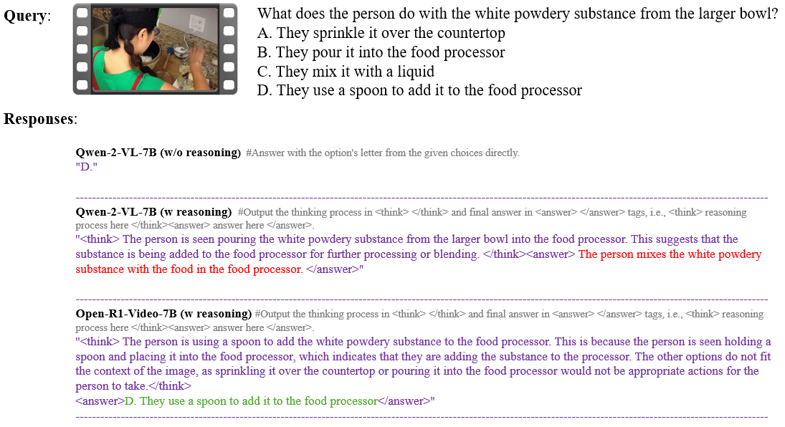

# Open R1 Video

We introduce R1's paradigm to video understanding tasks and open-sourced the training code and data.

[🤗 Models](https://huggingface.co/Xiaodong/Open-R1-Video-7B) | [🤗 Datasets](https://huggingface.co/datasets/Xiaodong/open-r1-video-4k) | [Wandb Logs](https://wandb.ai/xiaodongwang/Qwen2-VL-7B-Video-GRPO/runs/mb6ued4m?nw=nwuserxiaodongwang)

> [!NOTE] 
> Although our insights may not be guaranteed to be correct, we commit to sharing them truthfully and honestly. We welcome community feedback and discussions to improve our understanding on multimodal reasoning models.

## News
- [2025/02/22] We release a provisional model [Open-R1-Video-7B](https://huggingface.co/Xiaodong/Open-R1-Video-7B), inference scripts, and evaluation results.
- [2025/02/18] We release training code and data of Open-R1-Video!

## Our Findings
### GRPO training that forces thinking can improve video understanding



We train [Qwen2-VL-7B-Instruct](https://huggingface.co/Qwen/Qwen2-VL-7B-Instruct) on simple video dataset [open-r1-video-4k](https://huggingface.co/datasets/Xiaodong/open-r1-video-4k) using 4 x A100 (80G) GPUs, and the training only utilize video, query, and the ground truth answer (the letter of the correct answer). We only used GRPO (pure reinforcement learning without labeled reasoning trajectories) to train the model and achieved promising rewards during model training. We release our [wandb logs](https://wandb.ai/xiaodongwang/Qwen2-VL-7B-Video-GRPO/runs/mb6ued4m?nw=nwuserxiaodongwang) for reference.


**What We Did**
- Introduce R1 to Video-LMM (e.g., Qwen2-VL) based on [huggingface/open-r1](https://github.com/huggingface/open-r1) and [deepseek-ai/DeepSeek-R1](https://github.com/deepseek-ai/DeepSeek-R1). 
- Open-sourced the simple training data [open-r1-video-4k](https://huggingface.co/datasets/Xiaodong/open-r1-video-4k).
  - The simple reformat data is available in [open-r1-video-4k](https://huggingface.co/datasets/Xiaodong/open-r1-video-4k).
  - The video data is available in [LLaVA-Video-large-swift](https://huggingface.co/datasets/malterei/LLaVA-Video-large-swift).


## Training Models

> [!NOTE]
> The training commands below are configured for a node of 4 x A100 (80GB). For different hardware and topologies, you may need to tune the batch size and number of gradient accumulation steps.

### Set up
```
git clone https://github.com/Wang-Xiaodong1899/Open-R1-Video.git
cd Open-R1-Video
conda create -n r1 python=3.10
conda activate r1
pip3 install -e ".[dev]"
pip3 install flash_attn --no-build-isolation
cd qwen-vl-utils
pip install -e .
cd ..

# download data and put in data/
wget https://huggingface.co/datasets/Xiaodong/open-r1-video-4k/resolve/main/LLaVA-Video-large-swift-origin.jsonl
# like: data/LLaVA-Video-large-swift-origin.jsonl

# download videos
git lfs install
git clone https://huggingface.co/datasets/malterei/LLaVA-Video-large-swift

```


### GRPO on Qwen2-VL/7B
> [!NOTE] 
> Our training also support single A100 (80G) GPU training. Just modify the GPU and you’re good to go!

> We removed format accuracy during 7B model training and slightly modified the final answer matching to calculate the accuracy reward. See this [commit](https://github.com/Wang-Xiaodong1899/Open-R1-Video/commit/2679e082aaf608fd167a0ad5e6f2afb4f548e25f#diff-d6985fa15a3c7864e723ebd4c04bfdc2f13c5e87af36f87d656e32666f8e0eeb).

To run GRPO on Qwen2-VL-7B:

```
bash qwen-7b.sh
```

Please refer to [qwen-7b.sh](qwen-7b.sh) for more details.


## Evaluating models

### Inference

Infer the video reasoning model!
```
python infer.py
```


[Video link](https://youtu.be/2evryGv-oZ4)

Inference results:



### Evaluation

> [!NOTE] 
> We use [Lmms-eval](https://github.com/EvolvingLMMs-Lab/lmms-eval) to evaluate models.


| Benchmarks                | Qwen2-VL-7B-Instruct(w.o reasoning) | Qwen2-VL-7B-Instruct(w. reasoning) | Open-R1-Video-7B(w. reasoning)  |
|---------------------------|-------------------------------------|------------------------------------|---------------------------------|
| [LongVideoBench](https://longvideobench.github.io/) (16 frames) | 53.33                               | 41.89                              | 48.99 (↑7.1)                           |


## RL Data Reformat

We provide the easy reformat method to obtain the data for GRPO training, which only utilize video, query, and final answer. Please refer to [format_video_data.py](scripts/format_video_data.py) for more details.

Users can view data in [open-r1-video-4k](https://huggingface.co/datasets/Xiaodong/open-r1-video-4k). The `original question`/`original answer` are from the original dataset.

## References & Acknowledgements
We sincerely thank the contributions from the open source community, including the reproduction of [DeepSeek](https://github.com/deepseek-ai/DeepSeek-R1), [Open-R1](https://github.com/huggingface/open-r1), and [R1-multimodal](https://github.com/EvolvingLMMs-Lab/open-r1-multimodal), etc.

The related projects are as follows:
- [open-r1-multimodal](https://github.com/EvolvingLMMs-Lab/open-r1-multimodal)
- [lmm-r1](https://github.com/TideDra/lmm-r1)
- [DeepSeek](https://github.com/deepseek-ai/DeepSeek-R1) 
- [open-r1](https://github.com/huggingface/open-r1)
- [OpenRLHF](https://github.com/OpenRLHF/OpenRLHF)
- [LLaVA-NeXT](https://github.com/LLaVA-VL/LLaVA-NeXT)
- [LLaVA-Video-large-swift](https://huggingface.co/datasets/malterei/LLaVA-Video-large-swift)

## Citation
If you find this useful, you can choose to cite us.

```bibtex
@misc{wang-2025-open-r1-video,
  author = {Xiaodong Wang and Peixi Peng},
  title = {Open-R1-Video},
  year = {2025},
  publisher = {GitHub},
  journal = {GitHub repository},
  howpublished = {\url{https://github.com/Wang-Xiaodong1899/Open-R1-Video}}
}
```